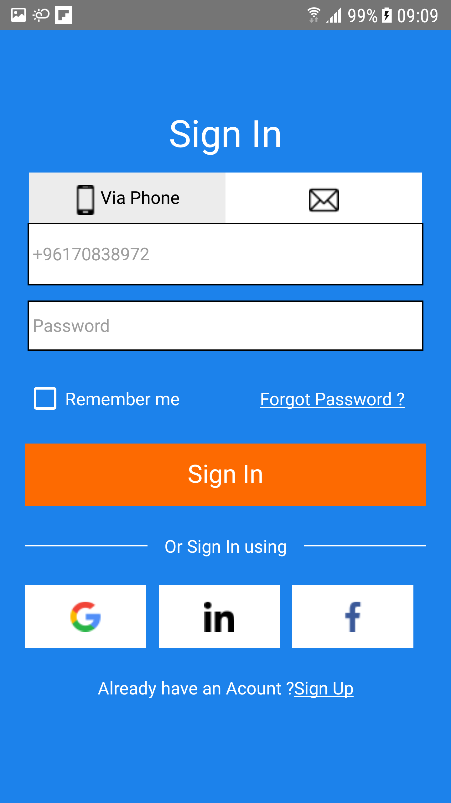
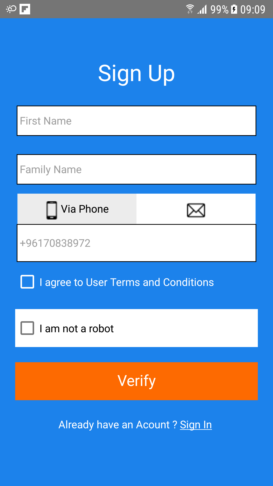

# SignIN, SignUP (React Native)

_SignIN, SignUP is a basic signIN and signUP App_

## 📱 DOWNLOAD LINKS

Playstore: _coming soon_  
Appstore: _coming soon_

## 📖 Table of content

- Screenshots
- Features
- Technologies used
- Requirements
- Installation
- Useful commands
- Note
- Contributing
- License

## 📷 Screenshots




## 🎉 Features

- Lightweight
- Built for every phone

## ⚙️ Technologies used

- React Native
- Android
- Objective-C

## ⚙️ Requirements

- Terminal (i.e: [Hyper](https://hyper.is/))
- Code Editor (i.e: [VScode](https://code.visualstudio.com/download))
- Browser (i.e: [Chrome](https://www.google.com/chrome/))
- [Android Studio](https://developer.android.com/studio) (OPTIONAL)
- Stable internet Connection
- Smartphone (preferably built after 2015)

## 📌 Installation And Running the project

1 - Install [Node](https://nodejs.org/en/)

2- Installing all Dependencies

```bash
npm install
```

3- Make sure you have the Android development environment set up: [Here](https://reactnative.dev/docs/environment-setup)

4- Enable [Debug mode](https://developer.android.com/studio/debug/dev-options#:~:text=To%20enable%20USB%20debugging%2C%20toggle,Android%208.0.) on Android

5- building the App on Android

```bash
npm run android
```

## 📍 Note

In case you got stuck at any point, checkout the official
documentation of [REACT NATIVE](https://reactnative.dev/).  
I will try to explain everything you need to know as comments in each file.

## Contributing

Pull requests are welcome. For major changes, please open  
 an issue first to discuss what you would like to change.

Please make sure to update tests as appropriate.

## License

[MIT](https://choosealicense.com/licenses/mit/)
..